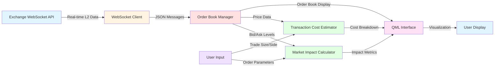

# Trading Simulator

[](LICENSE.md)
[]()
[](https://github.com/anaselii/Trading_Simulator/graphs/contributors)
[](https://github.com/AnasElii/Trading_Simulator)


A high-performance trading simulator built with C++ and Qt/QML that processes real-time market data from cryptocurrency exchanges to estimate transaction costs and measure market impact.

## Overview

This trading simulator connects to cryptocurrency exchange WebSocket feeds to receive real-time Level 2 order book data, processes market orders, and provides detailed analytics on transaction costs and market impact.

## Architecture



## Features

- **Real-time Market Data**: WebSocket connection to exchange L2 order book feeds
- **Order Simulation**: Simulates market buy/sell orders with configurable sizes
- **Impact Analysis**: Calculates and visualizes market impact metrics
- **Transaction Cost Estimation**: Provides detailed breakdown of trading costs
- **Modern UI**: Built with Qt/QML for a responsive interface
- **Cross-platform**: Supports Windows, macOS, and Linux
  
## Prerequisites

- CMake 3.10 or higher
- Qt 6.6 or higher (with WebSocket module)
- C++17 compatible compiler

## Configuration

### WebSocket Endpoint Setup

Before running the simulator, you **must** configure the WebSocket endpoint in `include/QuantConstants.h`:

```cpp
static constexpr const char* SOCKET_ENDPOINT = "wss://your-websocket-endpoint-here";
```

### Expected WebSocket Response Format

The simulator expects L2 order book data in the following JSON format:

```json
{
  "timestamp": "2025-05-04T10:39:13Z",
  "exchange": "OKX",
  "symbol": "BTC-USDT-SWAP",
  "asks": [
    ["95445.5", "9.06"],
    ["95448", "2.05"]
  ],
  "bids": [
    ["95445.4", "1104.23"],
    ["95445.3", "0.02"]
  ]
}
```

**Format Details:**
- `timestamp`: ISO 8601 formatted timestamp
- `exchange`: Exchange identifier (e.g., "OKX")
- `symbol`: Trading pair symbol
- `asks`: Array of [price, quantity] arrays (sell orders)
- `bids`: Array of [price, quantity] arrays (buy orders)

### Testing with OKX Exchange

You can test the simulator using **OKX SPOT exchange** WebSocket feeds, which provide data in the expected format:

```
wss://ws.okx.com:8443/ws/v5/public
```

Subscribe to order book updates using OKX's WebSocket API documentation.

## Installation

1. **Clone the repository:**
   ```bash
   git clone https://github.com/AnasElii/Trading_Simulator-.git
   cd Trading_Simulator-
   ```

2. **Configure the WebSocket endpoint:**
   Edit `include/QuantConstants.h` and set your WebSocket endpoint URL.

3. **Build the project:**
   ```bash
   mkdir build
   cd build
   cmake ..
   cmake --build .
   ```

4. **Run the simulator:**
   ```bash
   ./TradingSimulator
   ```

## Project Structure

```
Trading_Simulator-/
├── include/          # Header files
│   └── QuantConstants.h  # Configuration constants
├── interface/        # QML UI files
├── src/             # C++ source files
├── CMakeLists.txt   # CMake build configuration
└── README.md
```

## Usage

1. Launch the application
2. The simulator will connect to the configured WebSocket endpoint
3. Real-time order book data will be displayed
4. Enter order parameters (size, side) to simulate trades
5. View calculated market impact and transaction costs

## Key Components

- **Order Book Management**: Maintains real-time bid/ask levels
- **Market Impact Calculator**: Analyzes price impact of market orders
- **Transaction Cost Estimator**: Breaks down trading costs including slippage
- **WebSocket Client**: Handles real-time data streaming
- **QML Interface**: Provides interactive visualization

## API Keys (Optional)

If your exchange requires authentication, configure API credentials in `QuantConstants.h`:

```cpp
static QString GetApiKey();
static QString GetApiSecret();
static QString GetApiPassphrase();
```

## Contributing

Contributions are welcome! Please feel free to submit a Pull Request.

## License

This project is available for personal and educational use.

## Author

Anas Elii ([@AnasElii](https://github.com/AnasElii))

## Acknowledgments

This simulator was developed to demonstrate real-time market data processing and trading simulation capabilities.
